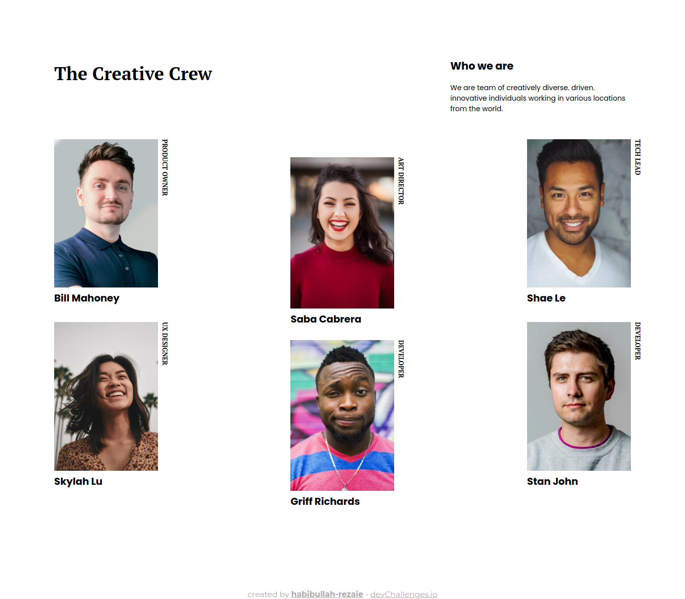
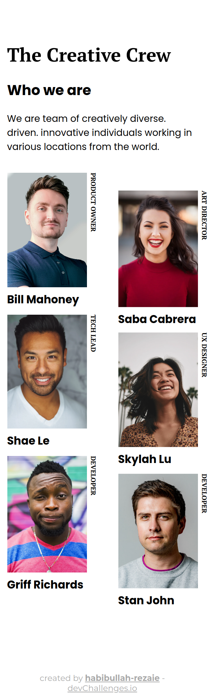

<!-- Please update value in the {}  -->

<h1 align="center">{My Team Page}</h1>

   Solution for a challenge from  <a href="http://devchallenges.io" target="_blank">Devchallenges.io</a>.

  <h3>
    <a href="https://habibullahs-team-page.netlify.app/">
      Demo
    </a>
     | 
    <a href="https://github.com/habibullah-rezaie/my-team-page">
      Solution
    </a>
     | 
    <a href="https://devchallenges.io/challenges/hhmesazsqgKXrTkYkt0U">
      Challenge
    </a>
  </h3>

<!-- TABLE OF CONTENTS -->

## Table of Contents

- [Overview](#overview)
  - [Built With](#built-with)
- [Features](#features)
- [Contact](#contact)
- [Acknowledgements](#acknowledgements)

<!-- OVERVIEW -->

## Overview

Introduce your projects by taking a screenshot or a gif. Try to tell visitors a story about your project by answering:

- Where can I see your demo?
- What was your experience?
- What have you learned/improved?
- Your wisdom? :)

You can see my demo at https://habibullahs-team-page.netlify.app/. I worked through this project and learned alot specailly about css grid, and flex box.
learning by doing has been great, and I looking forwared to continue further.
### Built With

<!-- This section should list any major frameworks that you built your project using. Here are a few examples.-->

- HTML
- CSS

## Features

<!-- List the features of your application or follow the template. Don't share the figma file here :) -->

This application/site was created as a submission to a [DevChallenges](https://devchallenges.io/challenges) challenge. The [challenge](https://devchallenges.io/challenges/hhmesazsqgKXrTkYkt0U) was to build an application to complete the given user stories.

## Acknowledgements

<!-- This section should list any articles or add-ons/plugins that helps you to complete the project. This is optional but it will help you in the future. For exmpale -->

- [CSS Mastery](https://www.amazon.com/CSS-Mastery-Advanced-Standards-Solutions/dp/1430223979)
- [Responsive Web Design with HTML5 and CSS](https://www.amazon.com/Responsive-Web-Design-HTML5-CSS-ebook/dp/B087D5FXXG)

## Contact

- GitHub [@habibullah-rezaie](https://github.com/habibullah-rezaie)
- Twitter [@HbRezaie](https://twitter.com/HbRezaie)